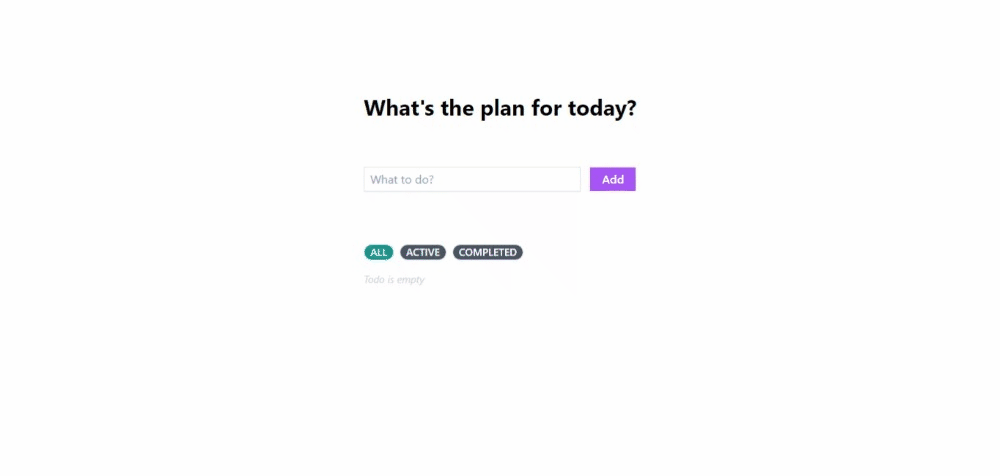

# Bootcamp Skilvul FullStack TPA5 - Todo App

This is [technical project assignment (TPA5) - Todo App ReactJs - Redux](https://github.com/impactbyte/full-stack-web-assignments/tree/master/TPA-002) from the Skilvul Bootcamp Fullstack of the Innovation Women Program 2023.

## Table of contents

- [Overview](#overview)
  - [Specs](#specs)
  - [Scheme](#scheme)
  - [Screenshot](#screenshot)
  - [Link](#links)
- [My process](#my-process)
  - [Built with](#built-with)
  - [What I learned](#what-i-learned)
- [Author](#author)


## Overview


### Specs

1. Create a Todo List application using React.js and state management Redux
2. Users can add 1 new Todo List
3. Users can see all Todo Lists (All) both active and completed
4. Users can view/filter the Todo List with active status
5. Users can view/filter the Todo List with completed status
6. Users can delete Todo List
7. Users can edit the Todo List

### Scheme
- The user was adding a todo, but the user changed his mind. User wants to edit todo / delete todo / view todo filter, automatically the process of adding todo is cancelled. This also applies to the todo editing process.

- The user is editing a todo, the user deletes all the content, then clicks save, the todo editing process is automatically cancelled. This also applies to the process of adding todos

### Screenshot




### Links

- Live Site URL: [Todo-App](https://todo-list-app-redux.netlify.app/)

## My process

### Built with

- React Js
- Redux
- Tailwind 


### What I learned

The recaps noted here are basic things that I rarely use.

- change useState to global state: 

```js
  // from this ...
  const [todo, setTodo] = useState('')
  const [isEditing, setIsEditing] = useState(false);
  const [editingTodoId, setEditingTodoId] = useState(null);
  const [editedTodoContent, setEditedTodoContent] = useState('');

  // to this ...
  editTodoId: null,
  editTodoContent: "",
  isEditing: false,
  inputTodoContent: "",
  isEmpty: false,
```

- create click management (if I click on this, then it will ... ) :
```js
// form this ... (without redux) 
  const deleteButton = (id) => {
    if (todo.trim() !== "") {
      // If the user is add todo, cancel add todo
      setTodo("");
    } else if (isEditing) {
      // If the user is editing, cancel editing
      setEditingTodoId(null);
      setIsEditing(false);
      setEditedTodoContent("");
    } else {
      // If the user is not editing, process delete todo
      dispatch(deleteTodo(id));
    }
  }

// to this ... (with redux)
  const deleteButton = (id) => {
    if (inputTodoContent.trim() !== "") {
      dispatch(cancelAdd())
    } else if (isEditing) {
      dispatch(cancelEdit())
    } else {
      dispatch(deleteTodo(id))
    }
  }
```

- When using redux for simple applications, using global state is very helpful. I thought about adding PropTypes, but for a simple app like TodoApp, it's not necessary. The reason is, each component can be connected to each other by utilizing Redux's global status. However, that doesn't mean that PropTypes are useless, but they will be very useful for large-scale applications. Also keep in mind the functions of state and props are different, so this will be the reason when to use them to write clean and readable code.


## Author

- Skilvul Profile - [@fidaatag](https://skilvul.com/profile/fidaatag)
- Twitter - [@fidaatag](https://twitter.com/fidaatag)
- Linkedin - [Fidaa Mustaghfiroh](https://www.linkedin.com/in/fidaatag/)

